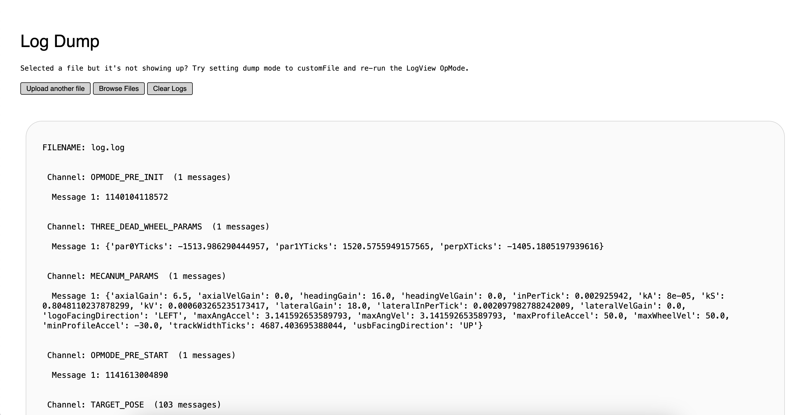
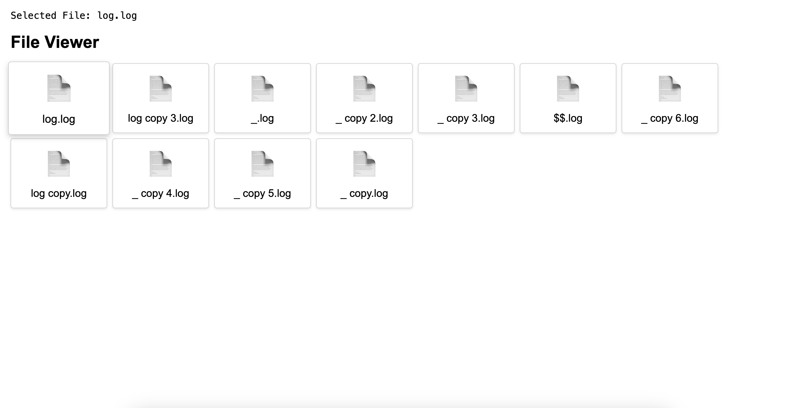

# What Log-Server is
Log-Server is a Python based HTTP server for uploading and analyzing log dump data from FlightRecorder. 

FlightRecorder dumps telemetry data into the RobotController's ROM storage as non-human-readable `.log` files. 

The Log-Viewer server generates an API and a web interface which creates a bridge between a local device and the `.log` files dumped by FlightRecorder.

**IMPORTANT NOTICE** - To abide by FTC rules, Log-Server does NOT support live read nor direct FS write access to internal SD memory. This tool can only be used post-match or during testing, and de-serializes and displays completed log files. 






# How to run

On Unix Machines:

```
git clone https://github.com/404-ma/Log-Server.git
```

```
python3 -m venv venv
```

```
source ./venv/bin/activate
```

```
pip install -r requirements.txt
```

```
python3 main.py
```

On Non-Unix Machine:

modify the cmd's above to be compliant for non-unix

**This works best when using the FTC dashboard to modify parameters and execute LogView**
